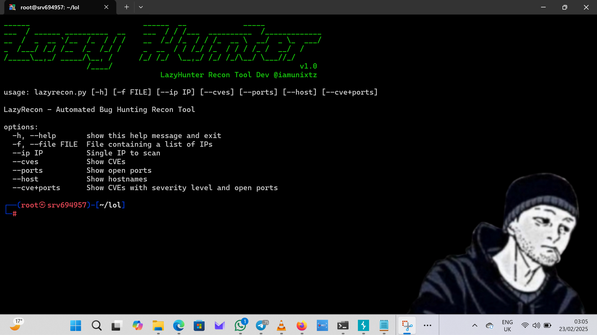
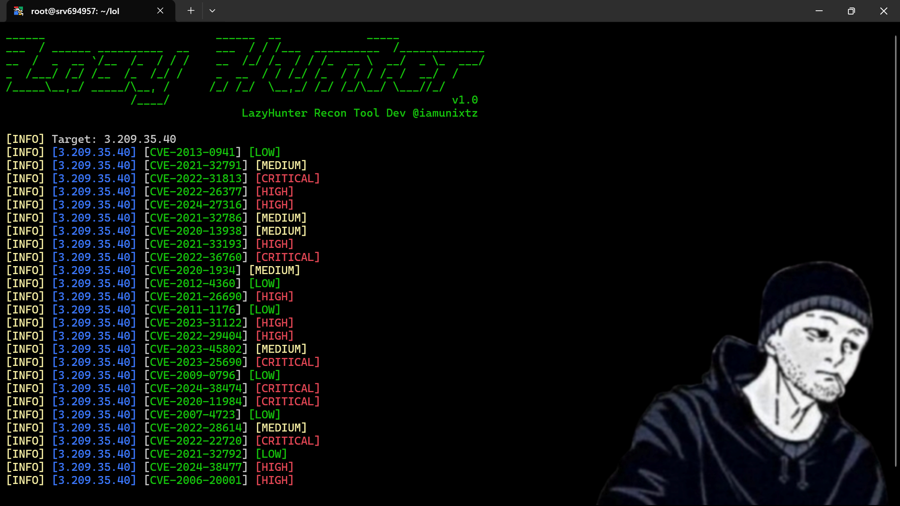

<h1 align="center">LazyHunter - Automated Bug Hunting Recon Tool</h1>

<p align="center">
  
  
  
  <br>
  
  
  <br>
  
</p>

LazyHunter is an automated reconnaissance tool designed for bug hunters, leveraging Shodan's InternetDB and CVEDB APIs. It retrieves open ports, hostnames, tags, and vulnerabilities for a given IP and fetches CVE details, including affected products and CVSS scores. Results are color-coded by severity for easy analysis.


## Features
- Fetch open ports, hostnames, and associated vulnerabilities for an IP address.
- Retrieve CVE details including severity levels.
- Color-coded output for easy identification of risk levels.
- Support for file input (`-f`) and output saving (`-o`).
- Option to display combined CVEs and open ports.

## Installation
```bash
# Clone the repository
git clone https://github.com/iamunixtz/Lazy-Hunter.git
cd Lazy-Hunter

# Install required dependencies
pip install -r requirements.txt

# Run the tool
python lazyhunter.py --help
```

## Command Usage
### Display Help Menu
```bash
python lazyhunter.py -h
```
#### Output:


### Scan a Single IP
```bash
python lazyhunter.py --ip 192.168.1.1
```
#### Output:


### Scan a List of IPs from a File
```bash
python lazyhunter.py -f targets.txt
```


### Display CVEs Only
```bash
python lazyhunter.py --ip 192.168.1.1 --cves
```


### Display Open Ports Only
```bash
python lazyhunter.py --ip 192.168.1.1 --ports
```

### Display Hostnames Only
```bash
python lazyhunter.py --ip 192.168.1.1 --host
```

### Show CVEs with Ports
```bash
python lazyhunter.py --ip 192.168.1.1 --cve+ports
```
#### Output:


### Show All Results (Default Behavior)
```bash
python lazyhunter.py --ip 192.168.1.1
```

## Attribution
This tool uses data from the [Shodan InternetDB](https://internetdb.shodan.io/) and [CVE Database](https://cvedb.shodan.io/). Credits to Shodan for their valuable security intelligence.

## Disclaimer
LazyHunter is intended for educational and authorized security research purposes only. Unauthorized usage against systems without explicit permission is illegal.

## License
LazyHunter is released under the MIT License. See `LICENSE` for more details.

